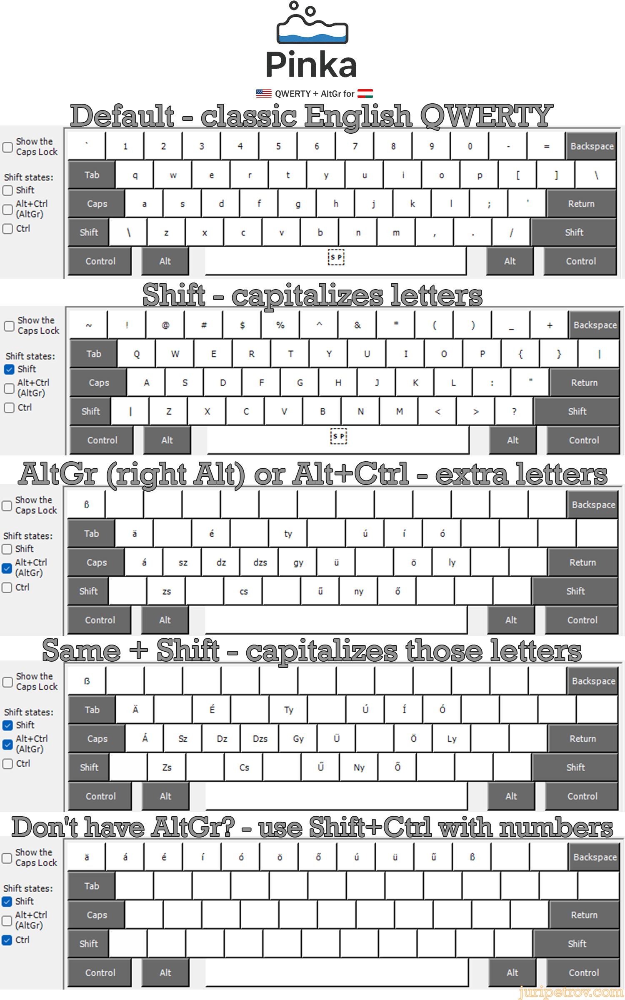

# Pinka Keyboard Layout

Named after the [Pinka river](https://en.wikipedia.org/wiki/Pinka)—the only river flowing through both Austria and Hungary with the same name in Hungarian, German, and English—Pinka adds full Hungarian and German support to the US QWERTY keyboard using the AltGr key. It keeps familiar punctuation and shortcuts while providing quick access to accented letters and digraphs.

## Features
- AltGr layer with á é í ó ö ő ú ü ű and digraphs like gy, ly, ny
- German umlauts and ß for Central European users
- Optional Ctrl+Shift accents on the number row for compact boards

## Installation
1. Download this repository as a ZIP file from GitHub (click **Code** ▸ **Download ZIP**) and extract it, or clone the repository.
2. Run `setup.exe` in the repository root—it automatically selects the correct package.
3. Add **Pinka** under *Time & Language → Language → Keyboard* in Windows settings.

## License
MIT
